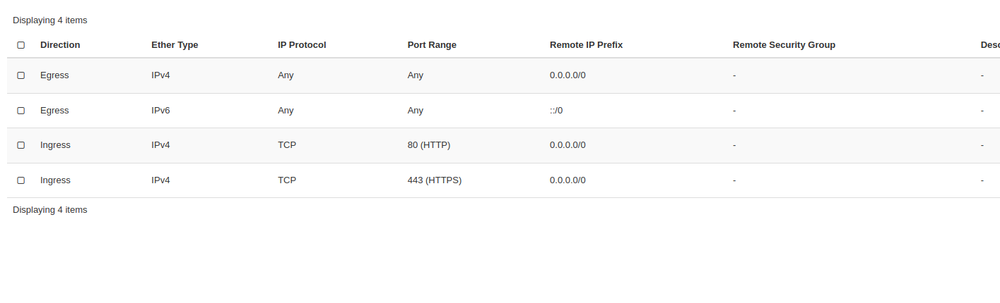

Web Application Installation
============================

The following are instructions on how to setup up your nimbus instance for the first time. If you have already done this you can skip to :ref:`start_server`.

Opening the Nimbus Instance Firewall
------------------------------------
Once you've set up the instance you need to open the firewall

https://support.pawsey.org.au/documentation/display/US/Allow+HTTPS+Access+To+Your+Instance

Then make a costum tcp rule for ports 80 and 443, should look like this

Then follow this guide to check things step by step

https://uwsgi-docs.readthedocs.io/en/latest/tutorials/Django_and_nginx.html

The following is examples of how I got it to work.

Goal 1: IP as URL
-----------------
First try and get it to work with the nimbus IP as the URL. From directory containing manage.py run the command:

.. code-block::

   uwsgi --socket frb-classifier.sock --module frb_cand.wsgi --chmod-socket=666

and nginx should look like this

.. code-block::

   upstream django {
      server unix:///home/ubuntu/FRB_candidates_app/frb_cand/frb-classifier.sock;
   }

   server {
      listen 80;
      server_name <IP>;
      charset     utf-8;

      # max upload size
      client_max_body_size 75M;

      location /static {
         alias /home/ubuntu/FRB_candidates_app/frb_cand/static_host;
      }

      # Finally, send all non-media requests to the Django server.
      location / {
         uwsgi_pass  django;
         include     /home/ubuntu/FRB_candidates_app/frb_cand/uwsgi_params;
      }

   }

and make sure the IP is in allowed hosts in settings.py:

.. code-block::

   ALLOWED_HOSTS = ['127.0.0.1', 'localhost', '<IP>']

Check if the works by using the IP as a URL in your browser.

Perimission errors
------------------
If you get a `(13: Permission denied)` error in the nginx logs here is a helpful fix

https://stackoverflow.com/questions/25774999/nginx-stat-failed-13-permission-denied

Static files errors
-------------------

If it's not finding the static files then setup the setting.py like this

.. code-block::

   STATIC_URL = '/static/'
   STATICFILES_DIRS = (
      os.path.join(BASE_DIR, "static/"),
   )
   STATIC_ROOT = os.path.join(BASE_DIR, "static_host/")

then run

.. code-block::

   python manage.py collectstatic

and update the nginx to

.. code-block::

   location /static {
      alias /home/ubuntu/FRB_candidates_app/frb_cand/static_host;
   }

Try a simple domain
-------------------
Grab a free subdomain from https://www.duckdns.org/domains that points to your ip then update the url in nginx's severname, and ALLOWED_HOSTS in settings.py

Getting a ssl certificate
-------------------------
Here are instructions on generating a ssl certificate

https://certbot.eff.org/instructions?ws=nginx&os=ubuntufocal